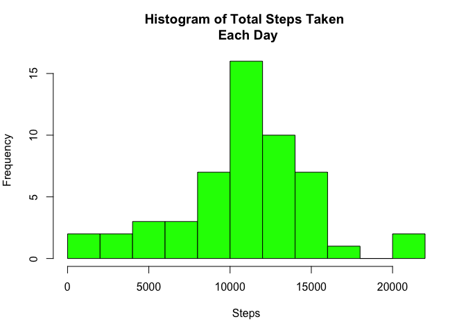
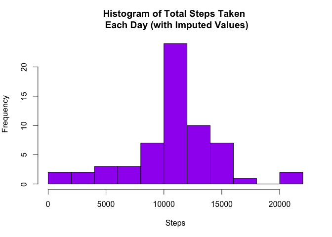
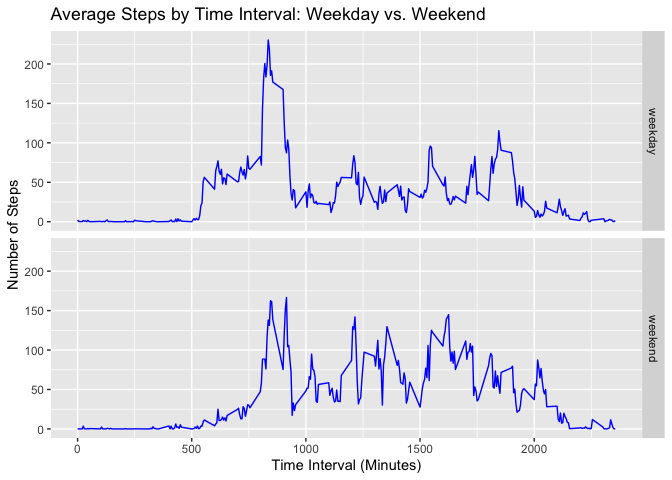

## Loading and preprocessing the data

Check / get working directory, and set up as necessary.


```r
      getwd()
      packages <- c("dplyr", "ggplot2", "lubridate")
      sapply(packages, require, character.only=TRUE, quietly=TRUE)
```

Create sub-directory to house raw data and another sub-directory to include exported plots.

```r
      if(!file.exists("./RawData")){dir.create("./RawData")} 
      if(!file.exists("./Plots")){dir.create("./Plots")}
```

Download data from URL (added step for sake of recording time of download, 
recorded in a text file).

```r
      fileUrl = "https://d396qusza40orc.cloudfront.net/repdata%2Fdata%2Factivity.zip"
      download.file(fileUrl,"./RawData/activity.zip", method="curl")
      unzip("./RawData/activity.zip")
      dateDownloaded <- date()
      dateDownloaded <- paste("Data was downloaded:", dateDownloaded[1])
      writeLines(dateDownloaded, con="./RawData/DateDataDownloaded.txt")
      list.files()
```

```
##  [1] "activity.csv"                  "activity.zip"                 
##  [3] "doc"                           "instructions_fig"             
##  [5] "PA1_template.Rmd"              "Plots"                        
##  [7] "RawData"                       "README.md"                    
##  [9] "RepData_PeerAssessment1.Rproj" "RRProject1.R"
```

#### 1) Load / read data

```r
      ACT <- read.csv("activity.csv", colClasses = "character")
```

#### 2) Process/transform the data into a format suitable for analysis

Convert column date to date class (from character class). Also convert columns 
*interval* and *steps* to integer and numerical classes (from character class).

```r
      dim(ACT)
```

```
## [1] 17568     3
```

```r
      str(ACT)
```

```
## 'data.frame':	17568 obs. of  3 variables:
##  $ steps   : chr  NA NA NA NA ...
##  $ date    : chr  "2012-10-01" "2012-10-01" "2012-10-01" "2012-10-01" ...
##  $ interval: chr  "0" "5" "10" "15" ...
```

```r
      head(ACT)
```

```
##   steps       date interval
## 1  <NA> 2012-10-01        0
## 2  <NA> 2012-10-01        5
## 3  <NA> 2012-10-01       10
## 4  <NA> 2012-10-01       15
## 5  <NA> 2012-10-01       20
## 6  <NA> 2012-10-01       25
```

```r
      ACT$date <- lubridate:: ymd(ACT$date)
      ACT$interval <- as.integer(ACT$interval)
      ACT$steps <- as.numeric(ACT$steps)
```

## What is mean total number of steps taken per day?

#### 1) Calculate the total number of steps taken per day
Create data object for total steps for each day (currently given by 5 min intervals).

```r
      daysteps <- aggregate(steps ~ date, data=ACT, sum)
```

#### 2) Make a histogram of the total number of steps taken each day

Plot histogram. Given base plotting system adds to existing plots, we remove any old exported versions of the plot before plotting.

```r
      if(file.exists("./Plots/plot1-hist-totalsteps.png")){file.remove("./Plots/plot1-hist-totalsteps.png")}
```


```r
      par(mfcol=c(1,1), mar=c(5,4,4,2), bg=NA)
      hist(daysteps$steps, col="green", xlab="Steps", 
           main="Histogram of Total Steps Taken \n Each Day",
           breaks=10)
```

<!-- -->

```r
      dev.copy(png,filename="./Plots/plot1-hist-totalsteps.png", width=480, height=400)
```

```
## quartz_off_screen 
##                 3
```

```r
      dev.off()
```

```
## quartz_off_screen 
##                 2
```

#### 3) Calculate and report the mean and median total number of steps taken per day.

**For this part of the assignment, you can ignore the missing values in the dataset.**

Use ```daysteps``` to calculate mean steps and median steps per day (2 decimals).


```r
      meandaysteps = round(mean(daysteps$steps, na.rm=TRUE),2) 
      mediandaysteps = round(median(daysteps$steps, na.rm=TRUE),2) 
      names(meandaysteps) <-"Mean Steps per Day"
      names(mediandaysteps) <-"Median Steps per Day"
      list(meandaysteps, mediandaysteps)
```

```
## [[1]]
## Mean Steps per Day 
##           10766.19 
## 
## [[2]]
## Median Steps per Day 
##                10765
```

*The mean total number of steps taken each day stored in object* **```meandaysteps```**.

*The median total number of steps taken each day stored in object* **```mediandaysteps```**.

## What is the average daily activity pattern?

#### 1) Make a time series plot (i.e. type = "l") of the 5-minute interval (x-axis) and the average number of steps taken, averaged across all days (y-axis)

Average all steps taken within intervals across all days, and plot.


```r
      intervalsteps <- aggregate(steps~interval, data=ACT, mean, na.rm=TRUE)

      if(file.exists("./Plots/plot2-timeseries-meanintervalsteps.png")){file.remove("./Plots/plot2-timeseries-meanintervalsteps.png")}
```


```r
      par(mfcol=c(1,1), mar=c(5,4,4,2), bg=NA)
      plot(steps ~ interval, data=intervalsteps, type="l",
           main="Average Steps Taken by 5-Minute Interval", 
           xlab="Time Interval (Minutes)", ylab="Mean Steps")
```

<!-- -->

```r
      dev.copy(png,filename="./Plots/plot2-timeseries-meanintervalsteps.png", width=480, height=400)
```

```
## quartz_off_screen 
##                 3
```

```r
      dev.off()
```

```
## quartz_off_screen 
##                 2
```

#### 2) Which 5-minute interval, on average across all the days in the dataset, contains the maximum number of steps?


```r
        maxIntStepsAv <- intervalsteps[which.max(intervalsteps$steps),]$interval
        names(maxIntStepsAv) <- "5-Minute Interval with Maximum Steps (on Average)"
        print(maxIntStepsAv)
```

```
## 5-Minute Interval with Maximum Steps (on Average) 
##                                               835
```

*The 5-minute interval containing the maximum number of steps (on average across all sample days) is stored in the object* **```maxIntStepsAv```**.

## Imputing missing values

Note that there are a number of days/intervals where there are missing values (coded as NA). The presence of missing days may introduce bias into some calculations or summaries of the data.

#### 1) Calculate and report the total number of missing values in the dataset (i.e. the total number of rows with NAs).

Note: missing values only exist for *steps* variable here (i.e. sum(is.na(ACT) = sum(is.na(ACT$steps) here).


```r
        totalmissing <- sum(is.na(ACT$steps))   
        names(totalmissing) <- "Total missing values in dataset"
        print(totalmissing)
```

```
## Total missing values in dataset 
##                            2304
```

*The total number of missing values in the dataset stored in object* **```totalmissing```**.

#### 2) Devise a strategy for filling in all of the missing values in the dataset. The strategy does not need to be sophisticated. For example, you could use the mean/median for that day, or the mean for that 5-minute interval, etc.

**Missing value strategy**: fill in all the missing values in the dataset with **mean steps per interval** (using ```intervalsteps``` object created earlier). 

The following function returns the mean steps taken for a particular interval.

```r
        intervalMeanSteps <- function(interval){
            intervalsteps[intervalsteps$interval==interval, ]$steps  
        }
```

#### 3) Create a new dataset that is equal to the original dataset but with the missing data filled in.

First we replicate the data object ```ACT```. Then, for each row, we wish to apply the ```intervalMeanSteps``` function where data are missing for the variable *steps* (specifying the relevant interval given in that row).

```r
      ACTnona <- ACT

      for(i in 1:nrow(ACTnona)){
          if(is.na(ACTnona[i,]$steps)) {
                ACTnona[i,]$steps <- intervalMeanSteps(ACTnona[i,]$interval)
          }
      }
```

*The new data set with no missing values is given by the object* **```ACTnona```**.

#### 4) Make a histogram of the total number of steps taken each day and calculate and report the mean and median total number of steps taken per day. Do these values differ from the estimates from the first part of the assignment? What is the impact of imputing missing data on the estimates of the total daily number of steps?

Create new data object for total steps for each day, and plot.


```r
      daysteps_nona <- aggregate(steps ~ date, data=ACTnona, sum)

      if(file.exists("./Plots/plot3-hist-nona_totalsteps.png")){file.remove("./Plots/plot3-hist-nona_totalsteps.png")}
```


```r
      par(mfcol=c(1,1), mar=c(5,4,4,2), bg=NA)
      hist(daysteps_nona$steps, col="purple", xlab="Steps", 
           main="Histogram of Total Steps Taken \n Each Day (with Imputed Values)",
           breaks=10)
```

<!-- -->

```r
      dev.copy(png,filename="./Plots/plot3-hist-nona_totalsteps.png", width=480, height=400)
```

```
## quartz_off_screen 
##                 3
```

```r
      dev.off()
```

```
## quartz_off_screen 
##                 2
```

Use ```daysteps_nona``` to calculate mean and median steps per day (2 decimals) for data with imputed values.


```r
        meandaysteps_imp = round(mean(daysteps_nona$steps, na.rm=TRUE),2) 
        mediandaysteps_imp = round(median(daysteps_nona$steps, na.rm=TRUE),2) 
        names(meandaysteps_imp) <-"Mean Steps per Day (with imputed values)"
        names(mediandaysteps_imp) <-"Median Steps per Day (with imputed values)"
        list(meandaysteps_imp, meandaysteps, mediandaysteps_imp, mediandaysteps)
```

```
## [[1]]
## Mean Steps per Day (with imputed values) 
##                                 10766.19 
## 
## [[2]]
## Mean Steps per Day 
##           10766.19 
## 
## [[3]]
## Median Steps per Day (with imputed values) 
##                                   10766.19 
## 
## [[4]]
## Median Steps per Day 
##                10765
```
*The mean total number of steps taken each day stored in object* **```meandaysteps_imp```**.

*The median total number of steps taken each day stored in object* **```mediandaysteps_imp```**.

There was no change in the mean after replacing NAs with averages (as may be expected), and the median increased by a very small margin (~0.1%) to become equal with the mean (imputing means increases the set of data from which to compute and therefore shifts the median toward the mean).

The impact of imputing missing data on the estimates of the total daily number of steps: from the histogram, we see we have higher frequency counts around the center (increased central tendency).

## Are there differences in activity patterns between weekdays and weekends?

For this part the ```weekdays()``` function may be of some help here. Use the dataset with the filled-in missing values for this part. 

#### 1) Create a new factor variable in the dataset with two levels – “weekday” and “weekend”, indicating whether a given date is a weekday or weekend day.

Create variable *day* to indicate day of the week. Then, using the days of the week indicated, replace *day* values with "weekday" and "weekend" using a loop. *day* will be the indicator variable.

```r
      ACTnona$day <- weekdays(ACTnona$date)

      for (i in 1:nrow(ACTnona)) {
          if (ACTnona[i,]$day %in% c("Saturday","Sunday")) {
              ACTnona[i,]$day<-"weekend"
          }
          else{
              ACTnona[i,]$day<-"weekday"
          }
      }

      ACTnona$day <- as.factor(ACTnona$day)
```

Here we can also create data object for average steps for each interval and type of day (**for next step**).

```r
      intstepsbyday <- aggregate(ACTnona$steps ~ ACTnona$interval + ACTnona$day, 
                             data=ACTnona, mean)
      head(intstepsbyday)
```

```
##   ACTnona$interval ACTnona$day ACTnona$steps
## 1                0     weekday    2.25115304
## 2                5     weekday    0.44528302
## 3               10     weekday    0.17316562
## 4               15     weekday    0.19790356
## 5               20     weekday    0.09895178
## 6               25     weekday    1.59035639
```

```r
      names(intstepsbyday) <- c("interval", "day", "steps")
```

#### 2) Make a panel plot containing a time series plot (i.e. type = l) of the 5-minute interval (x-axis) and the average number of steps taken, averaged across all weekday days or weekend days (y-axis). See the README file in the GitHub repository to see an example of what this plot should look like using simulated data.

Use ```ggplot``` to create multiple plots by factor variable.


```r
      g <- ggplot(data=intstepsbyday, aes(interval, steps))
      g+geom_line(col="blue") +
          facet_grid(day ~ .) +
          ggtitle("Average Steps by Time Interval: Weekday vs. Weekend") +
          labs(x="Time Interval (Minutes)", y="Number of Steps")
```

<!-- -->

```r
      dev.copy(png,filename="./Plots/plot4-hist-nona_avrintstepsbydaytype.png", width=480, height=400)
```

```
## quartz_off_screen 
##                 3
```

```r
      dev.off()
```

```
## quartz_off_screen 
##                 2
```
